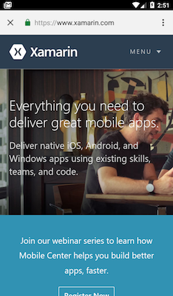
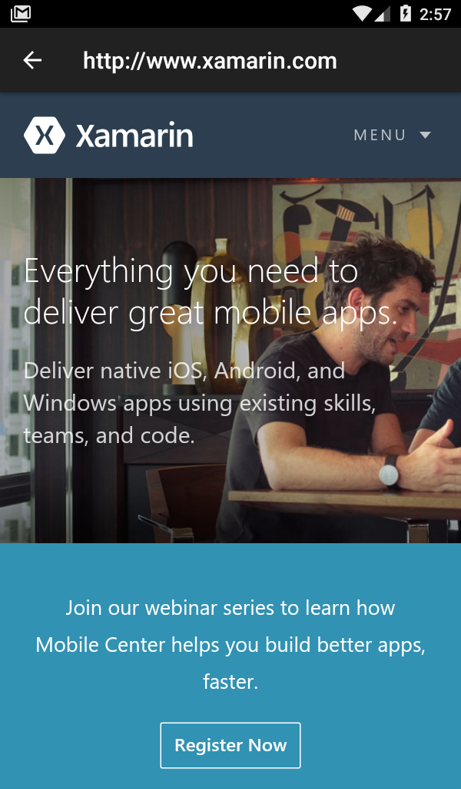
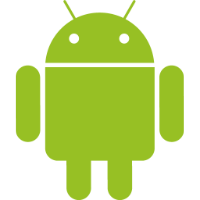

#SushiHangover.GoogleChrome.CustomTabs.Shared

**`Xamarin.Android` implemetation of `Android.Support.CustomTabs.Shared` with demos**

This is a `Xamarin.Android` `C#` port of the `Java` code located at [GoogleChrome/custom-tabs-client](https://github.com/GoogleChrome/custom-tabs-client)

* Java-based [Application](https://github.com/GoogleChrome/custom-tabs-client/tree/master/Application) -> C#-based [Application](https://github.com/sushihangover/SushiHangover.GoogleChrome.CustomTabs.Shared/tree/master/src/Application)
* Java-based [customtabsdemos](https://github.com/GoogleChrome/custom-tabs-client/tree/master/demos/src/main) -> C#-based [AndroidCustomTabs](https://github.com/sushihangover/SushiHangover.GoogleChrome.CustomTabs.Shared/tree/master/src/AndroidCustomTabs)
* Java package `org.chromium.customtabsclient.shared` converted to 
* C# Nuget in namepsace `Android.Support.CustomTabs.Shared`

###Using Chrome-based CustomTabs is **Easy**

	var url = "https://www.xamarin.com";
	var customTabsIntent = new CustomTabsIntent.Builder().Build();
	CustomTabActivityHelper.OpenCustomTab(this, customTabsIntent, Uri.Parse(url), new WebviewFallback());

If Chrome is not installed, you have complete control over a fallback, the above example is using a WebView-based Activity

* **Logcat (Chrome Beta installed and being used):**

<code>
	[CustomTabsHelper] PackageNameToUse: com.chrome.beta
</code>

* **Logcat (Chrome is not install, using WebView:**

<code>
	[CustomTabsHelper] PackageNameToUse: 
	[WebViewFactory] Loading com.android.webview version ....
</code>

  
  
##Current project status:

##Chrome Custom Tabs - Examples and Documentation

Re: [https://github.com/GoogleChrome/custom-tabs-client](https://github.com/GoogleChrome/custom-tabs-client)

>Chrome Custom Tabs provides a way for an application to customize and interact with a Chrome Activity on Android. This makes the web content feel like being a part of the application, while retaining the full functionality and performance of a complete web browser.

##Nuget:

<code>
PM> Install-Package SushiHangover.Android.Support.CustomTabs.Shared
</code>

Ref: [https://www.nuget.org/packages/SushiHangover.Android.Support.CustomTabs.Shared](https://www.nuget.org/packages/SushiHangover.Android.Support.CustomTabs.Shared)

##Xamarin Linker Friendly:

This library is linker friendly (`[assembly:LinkerSafe]`) and uses conditional preservation on members (`[Preserve(Conditional = true)]`)

* [Linking on Android](https://developer.xamarin.com/search?q=linking%20on%20android)

###CustomTabs Reading Material:

####[Modernizing OAuth interactions in Native Apps for Better Usability and Security](https://developers.googleblog.com/2016/08/modernizing-oauth-interactions-in-native-apps.html)

>On April 20, 2017, we will start blocking OAuth requests using web-views for all OAuth clients on platforms where viable alternatives exist.

####[Chrome Custom Tabs]( https://developer.chrome.com/multidevice/android/customtabs)

>Chrome Custom Tabs also allow the developer to pre-start Chrome and pre-fetch content for faster loading.
>

##License

Consult [LICENSE](https://github.com/sushihangover/SushiHangover.GoogleChrome.CustomTabs.Shared/blob/master/LICENSE)

<head>

</head>

